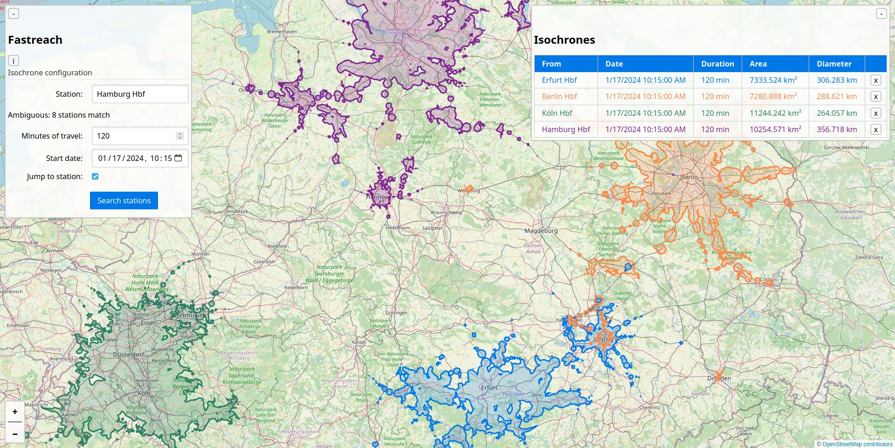

# Fastreach


Fastreach is a lightweight implementation of isochrone-based reachability for public transportation networks.
It's designed to provide quick estimations of reachable area, while prioritizing efficiency over pinpoint accuracy.



## Motivation
Isochrones are valuable tools for visualizing and understanding transportation networks and travel times.
They are essentially lines on a map that connect points that can be reached within a specific time frame from a given starting point.
Isochrones are particularly useful for assessing the locations that can be reached within a certain duration.
Individuals can determine which places (offices, sights, shopping centers, etc.) are reachable from their home within a particular time frame.
This helps planning daily activities and commuting.

Additionally, combining multiple isochrones can identify strong and weak nodes of a transportation network.
Identifying strong and weak nodes is useful for optimizing transportation networks and improving accessibility.

## Usage
The API can be started by running:
```sh
cargo run --bin fastreach-api --release
```
in the root directory of the project.
The API expects a `graph.bin` file generated with [netex-parse](https://github.com/Nuckal777/netex-parse) binary output in its working directory.
This can be changed by setting the `FASTREACH_GRAPH` environment variable to a desired path.
The maximum allowed isochrone duration is set to 120 minutes and can be overwritten by setting the `FASTREACH_MAX_MINUTES` environment variable.

The UI can be started by running:
```sh
npm install
npm run dev
```
within the fastreach-ui folder.
The `nodes.json` file generated by [netex-parse](https://github.com/Nuckal777/netex-parse) should be placed in the same folder.
Additionally, a `docker-compose.yaml` is available.

## How it works
Fastreach models the transportation network as a graph.
Nodes represent stations, edges vehicles with or without timetables.
Given a duration reachable stations are determined with dijsktra's algorithm.
For each reached station an approximate circle based on the remaining time and walking speed is created.
These are finally merged to retrieve the reachable area.
Efficency is achieved by memory-mapping a custom pre-processed binary representation of the transportation network.
